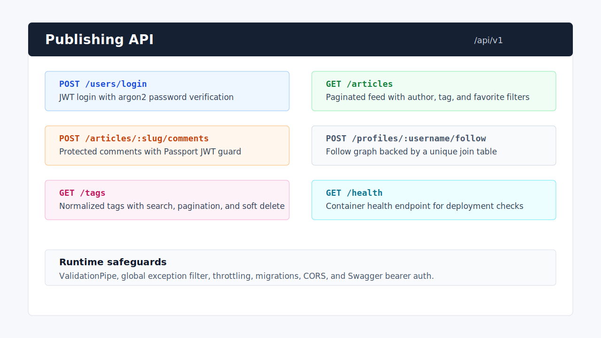
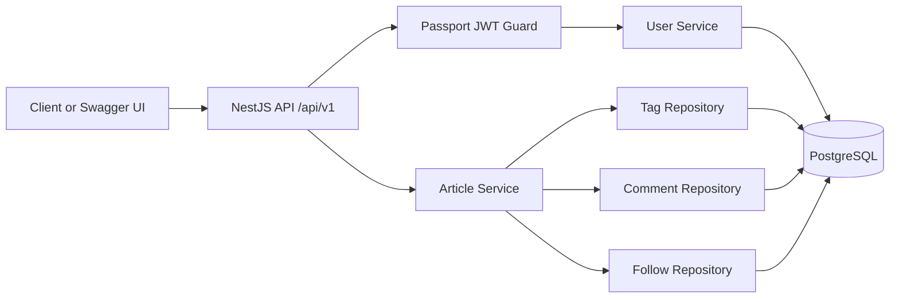

# Publishing API

NestJS REST API for a Medium-style publishing platform. It covers user auth, article publishing, comments, favorites, profile follows, normalized tags, Swagger docs, Docker, and production-oriented error/rate-limit handling.



## Highlights

- Passport JWT authentication with `@nestjs/passport` and `@nestjs/jwt`
- Argon2 password hashing and protected current-user/article/follow actions
- Articles, comments, favorites, personalized feed, and profile follow graph
- Normalized tag model using a many-to-many `article_tags` join table
- PostgreSQL migrations, TypeORM repositories, validation pipes, and Swagger docs
- Global exception filter to avoid leaking unexpected stack traces
- Global API throttling with environment-based limits
- Docker Compose with Postgres and health checks for both database and app

## Flow



## Business Decisions

- Auth is handled by Passport strategies and guards, while the `@User()` decorator only reads `req.user`.
- `tagList` remains the public API response shape, but persistence uses normalized `tags` and `article_tags` tables for queryable tags.
- Tag creation during article publishing is idempotent: existing tags are reused and missing tags are created.
- Profile reads support optional auth so a logged-in user can see whether they follow the target profile.
- Unexpected errors are logged server-side and returned as stable JSON without stack traces.
- Rate limiting is global by default because public write endpoints such as registration and login still need abuse protection.

## API Surface

- Base URL: `http://localhost:3000/api/v1`
- Swagger docs: `http://localhost:3000/docs`
- Health check: `http://localhost:3000/api/v1/health`

Key groups:

- `POST /users`, `POST /users/login`, `GET /user`, `PUT /user`
- `GET /articles`, `GET /articles/feed`, `POST /articles`
- `GET /articles/:slug`, `PUT /articles/:slug`, `DELETE /articles/:slug`
- `POST /articles/:slug/comments`, `DELETE /articles/:slug/comments/:id`
- `POST /articles/:slug/favorite`, `DELETE /articles/:slug/favorite`
- `GET /profiles/:username`, `POST /profiles/:username/follow`
- `GET /tags`, `POST /tags`, `PUT /tags/:id`, `DELETE /tags/:id`

## Setup

```bash
npm install
cp .env.example .env
npm run migration:run
npm run start:dev
```

PowerShell:

```powershell
npm install
Copy-Item .env.example .env
npm run migration:run
npm run start:dev
```

## Docker

```bash
docker compose up --build
```

The app waits for Postgres health before starting. The app container then checks `GET /api/v1/health`.

## Environment

```env
PORT=3000
NODE_ENV=development

DB_HOST=localhost
DB_PORT=5432
DB_USER=postgres
DB_PASS=password
DB_NAME=publishing_api

JWT_SECRET=replace-with-a-long-random-secret
ALLOWED_ORIGINS=http://localhost:3000,http://localhost:5173

THROTTLE_TTL_MS=60000
THROTTLE_LIMIT=100
```

## Scripts

```bash
npm run build
npm run start:dev
npm run migration:run
npm run migration:revert
npm run test
npm run test:cov
```
