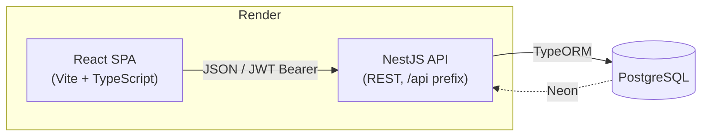

# Conduit — a Medium-style publishing platform

A full-stack Medium clone: a NestJS + PostgreSQL REST API behind a React SPA,
deployed and live.

**🌐 Live demo:** [mediumclone-frontend.onrender.com](https://mediumclone-frontend.onrender.com)
· **API health:** [/api/health](https://mediumclone-api.onrender.com/api/health)

> Free-tier hosting: the API sleeps when idle, so the first request can take
> ~50 seconds to cold-start.

## Features

- Email/password auth with **JWT access tokens + refresh token rotation**
- Articles with tags, favorites, and **comments**
- Author profiles and follows
- Full-text search, tag filtering, pagination, and whitelisted sorting
- **Database-backed RBAC** (roles → permissions) enforced through CASL
  policies, with ownership rules ("edit your own article") as conditional
  abilities
- Rate limiting on write endpoints, request validation, standardized response
  envelope
- **Redis caching with graceful degradation** — the tag listing is cached
  (short TTL + invalidation on writes) and rate-limit counters live in Redis
  so they survive restarts and shared across instances; if Redis is down or
  unconfigured, the app transparently falls back to Postgres reads and
  in-memory counters
- Migration-driven schema — TypeORM `synchronize` is off everywhere

## Architecture


```mermaid
flowchart LR
    Browser["React SPA<br/>(Vite + TypeScript)"] -->|"JSON / JWT Bearer"| API["NestJS API<br/>(REST, /api prefix)"]
    API -->|TypeORM| DB[("PostgreSQL")]
    subgraph Render
        Browser
        API
    end
    DB -.->|Neon| API
```

- **`src/`** — NestJS API: `auth` (tokens), `authorization` (RBAC + CASL),
  `posts`, `comments`, `profile`, `tag`, `user`, `health`
- **`frontend/`** — React SPA: fetch-based API client with automatic token
  refresh, context-based auth state, plain CSS design system

## Getting started

Requires Node 20+ and a local PostgreSQL.

```bash
# API
npm install
cp .env.example .env        # fill in DB credentials
npm run migration:run
npm run start:dev           # http://localhost:3000/api

# Frontend (second terminal)
cd frontend
npm install
npm run dev                 # http://localhost:5173
```

The schema is migration-driven: entity changes require a generated migration
(`npm run migration:generate -- src/database/migrations/<Name>`), which runs
via `npm run migration:run` (locally) or automatically on boot in production
(`MIGRATIONS_RUN=true`).

## Authorization (RBAC)

Authorization is database-backed and policy-based.

- **Roles and permissions are data.** Roles (`role`), permissions (`permission`,
  an `action` + `subject` pair such as `create` + `Article`) and their links
  (`role_permissions`, `user_roles`) live in the database. A seeder upserts the
  default catalog on every boot, so `user`, `moderator` and `admin` always exist
  with their expected permissions. New roles can be created at runtime — no
  redeploy required.
- **CASL abilities.** On each request the caller's roles are resolved to a
  deduplicated permission set and compiled into a CASL ability. Role permissions
  are granted unconditionally; ownership rules ("edit your own article", "delete
  your own comment") are added as conditional rules for every authenticated
  user, so ownership and privilege are evaluated uniformly.
- **Global guards + decorators.** A global `JwtAuthGuard` authenticates every
  request except those marked `@Public()`; a global `PoliciesGuard` then enforces
  `@RequirePermissions({ action, subject })` and `@CheckPolicies(...)` metadata.
  Instance-level checks (own-vs-any) run in services via the `CaslAbilityFactory`.
- **First admin.** Set `RBAC_BOOTSTRAP_ADMIN_EMAIL` to an existing user's email
  to have the seeder grant them the `admin` role on boot.

Defaults: `user` authors their own content and comments; `moderator` adds tag
curation and comment moderation; `admin` holds every permission, including role
administration.

## API routes

| Method | Route | Notes |
| --- | --- | --- |
| `POST` | `/auth/register` | Create an account and issue tokens |
| `POST` | `/auth/login` | Issue tokens for an existing account |
| `POST` | `/auth/refresh` | Rotate a refresh token |
| `POST` | `/auth/logout` | Revoke the current refresh token |
| `GET` | `/user` | Read the current user |
| `PUT` | `/user` | Update the current user |
| `GET` | `/user/permissions` | Read the caller's effective roles and abilities |
| `GET` | `/posts` | List posts (filter by tag/author/favorited, search, sort, paginate) |
| `POST` | `/posts` | Create a post |
| `GET` | `/posts/:slug` | Read a post |
| `PUT` | `/posts/:slug` | Update a post (author or `update:Article`) |
| `DELETE` | `/posts/:slug` | Delete a post (author or `delete:Article`) |
| `POST` | `/posts/:slug/favorite` | Favorite a post |
| `DELETE` | `/posts/:slug/favorite` | Remove a favorite |
| `GET` | `/posts/:slug/comments` | List a post's comments |
| `POST` | `/posts/:slug/comments` | Comment on a post |
| `DELETE` | `/posts/:slug/comments/:id` | Delete a comment (author or `delete:Comment`) |
| `GET` | `/profiles/:username` | Read an author profile |
| `POST` | `/profiles/:username/follow` | Follow an author |
| `DELETE` | `/profiles/:username/follow` | Unfollow an author |
| `GET` | `/tags` | List tags |
| `POST` | `/tags` | Create a tag (requires `manage:Tag`) |
| `PUT` | `/tags/:id` | Update a tag (requires `manage:Tag`) |
| `DELETE` | `/tags/:id` | Delete a tag (requires `manage:Tag`) |
| `PATCH` | `/users/:id/roles` | Set a user's roles (requires `manage:Role`) |
| `GET` | `/admin/permissions` | List the permission catalog (requires `read:Role`) |
| `GET` | `/admin/roles` | List roles (requires `read:Role`) |
| `POST` | `/admin/roles` | Create a role (requires `manage:Role`) |
| `GET` | `/admin/roles/:id` | Read a role (requires `read:Role`) |
| `PATCH` | `/admin/roles/:id` | Update role metadata (requires `manage:Role`) |
| `PUT` | `/admin/roles/:id/permissions` | Replace a role's permissions (requires `manage:Role`) |
| `DELETE` | `/admin/roles/:id` | Delete a non-system role (requires `manage:Role`) |

All routes are served under the `/api` prefix.

## Deployment

Live on Render (API web service + static frontend) with PostgreSQL on Neon.
See [DEPLOYMENT.md](DEPLOYMENT.md) for the full setup, including the
[render.yaml](render.yaml) blueprint.
